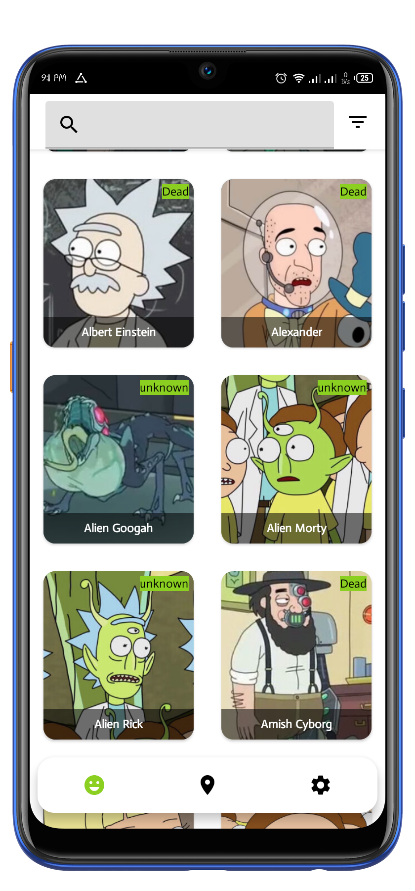
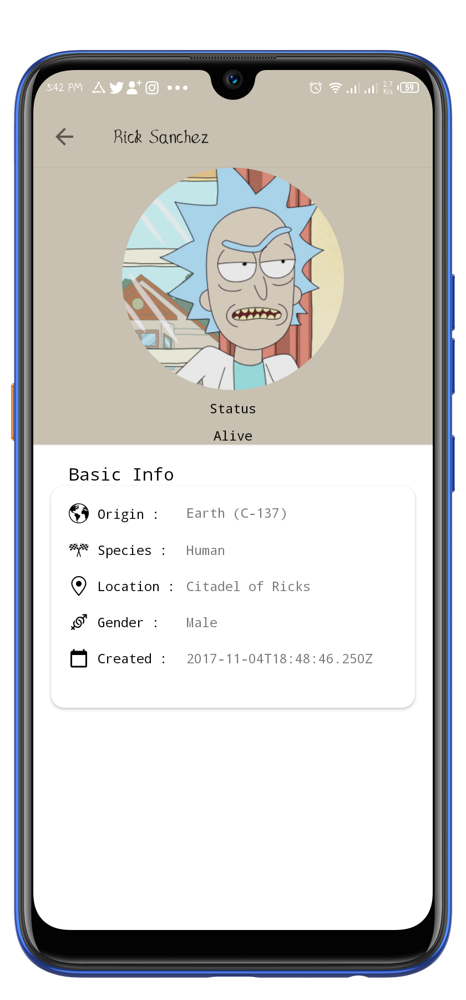
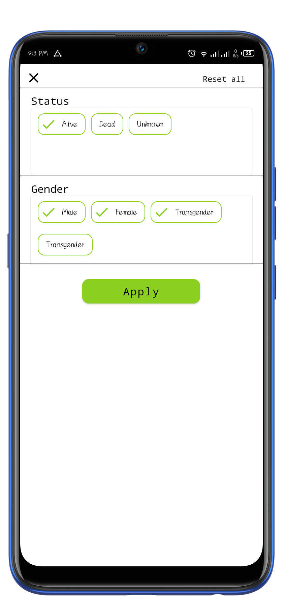
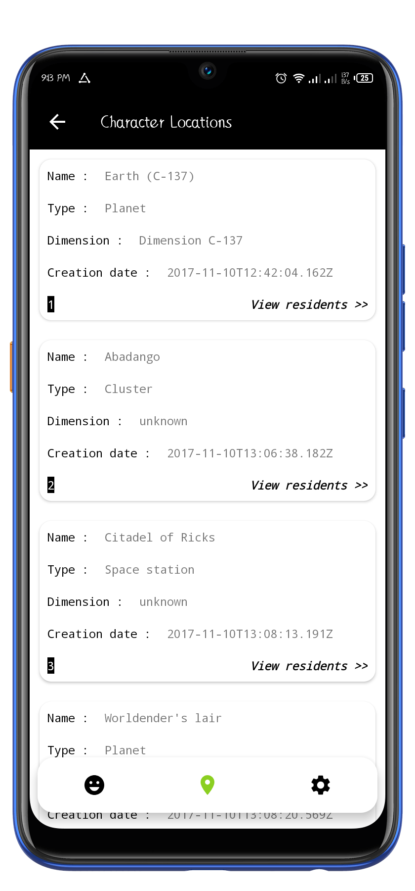

# RickandMorty
This repo was made with the purpose of  showing details on how to use paging 3 with retrofit and LiveData/Flow. It also used  MVVM architecture with Dagger Hilt for dependency injection.

**The app is still on development. Not fully complete**

# Libraries
- [Navigation Components](https://developer.android.com/guide/navigation/navigation-getting-started) -  Helps you implement navigation, from simple button clicks to more complex patterns, such as app bars and the navigation drawer.
- [Viewmodel](https://developer.android.com/topic/libraries/architecture/viewmodel) -The ViewModel class is designed to store and manage UI-related data in a lifecycle conscious way
- [LiveData](https://developer.android.com/topic/libraries/architecture/livedata) -  A lifecycle-aware data holder with the observer pattern
- [Hilt-Dagger](https://developer.android.com/training/dependency-injection/hilt-android) - Hilt is a dependency injection library for Android that reduces the boilerplate of doing manual dependency injection in your project. Doing manual dependency injection requires you to construct every class and its dependencies by hand, and to use containers to reuse and manage dependencies.
- [MVVM](https://www.geeksforgeeks.org/mvvm-model-view-viewmodel-architecture-pattern-in-android/) - MVVM stands for Model, View, ViewModel. Model: This holds the data of the application. It cannot directly talk to the View. Generally, it's recommended to expose the data to the ViewModel through Observables.
- [Paging 3](https://developer.android.com/topic/libraries/architecture/paging/v3-overview) - The Paging library helps you load and display pages of data from a larger dataset from local storage or over network.
- [Flows](https://developer.android.com/kotlin/flow) -  A flow is a type that can emit multiple values sequentially, as opposed to suspend functions that return only a single value.
- [Okhttp-Logging-Interceptor](https://square.github.io/okhttp/) - Logs HTTP request and response data.
- [Kotlin Coroutines](https://developer.android.com/kotlin/coroutines) - A concurrency design pattern that you can use on Android to simplify code that executes asynchronously 

# Screenshots

  

 
  ## Support
- Found this project useful ❤️? Support by clicking the ⭐️ button on the upper right of this page. ✌
- Feel free to contribute in any way to the project from typos in docs to code review are all welcome.

